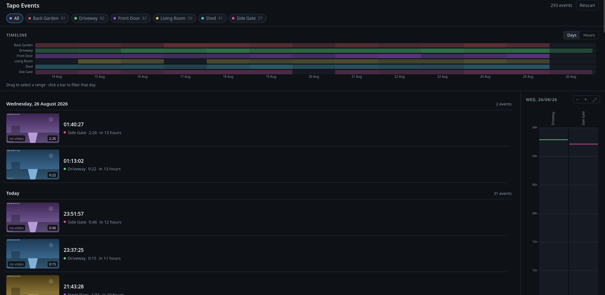
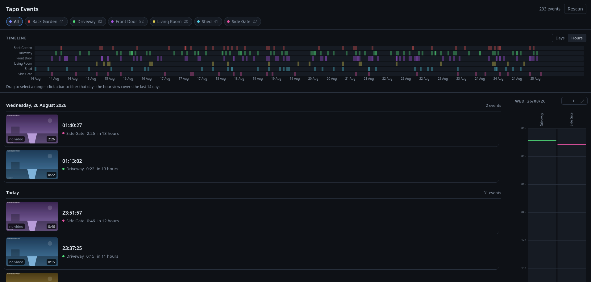
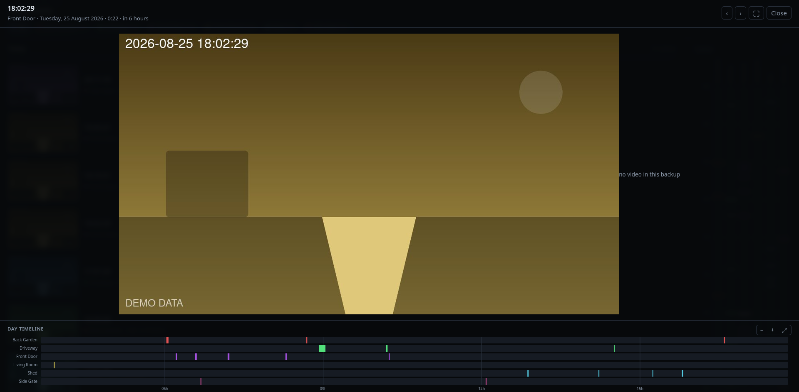

# Tapo Camera Recordings Viewer

A small self-hosted browser for recordings pulled off TP-Link Tapo cameras — the folder-per-camera
backup that the inofficial Home Assistant integration creates.

Point it at the backup directory and it gives you a filterable event list, a per-camera density
timeline, a day bar and an inline video viewer. Nothing is copied, converted or written: the app
only ever reads the folder.

Deno on the backend, plain ES modules on the frontend. No build step, no bundler, no dependencies
beyond the Deno standard library.

## Screenshots

The event list: camera filter chips with counts, the multi-camera density timeline, and the
day-grouped events with thumbnails, with the day rail on the right.



The timeline switches to an hour view over the last 14 days, so a busy stretch can be picked apart
hour by hour. Drag across it to select a range, or click a single bar to filter that day.



Opening an event plays it inline, with every camera's day timeline underneath and prev/next
navigation through the neighbouring events.



## Expected folder layout

```
<TAPO_ROOT>/<camera>/thumbs/<start>-<end>.jpg
<TAPO_ROOT>/<camera>/videos/<start>-<end>.mp4
```

## Running locally

```sh
deno task dev      # watch mode on http://127.0.0.1:8000
deno task start    # same, without the watcher
deno task test     # unit tests
deno task check    # typecheck
```

Put the recordings in `./tapo`, or set `TAPO_ROOT` elsewhere.

## Configuration

All optional, all environment variables.

| Variable            | Default         | Meaning                                            |
| ------------------- | --------------- | -------------------------------------------------- |
| `TAPO_ROOT`         | `./tapo`        | Directory holding the per-camera folders           |
| `PORT`              | `8000`          | Listen port                                        |
| `HOST`              | `127.0.0.1`     | Bind address; a container needs `0.0.0.0`          |
| `DISPLAY_TZ`        | `Europe/Berlin` | Timezone for day/hour bucketing                    |
| `TS_OFFSET_SECONDS` | `-3600`         | Correction applied to filename timestamps          |
| `RESCAN_INTERVAL_S` | `1800`          | Seconds between background rescans                 |
| `TAGS_FILE`         | _(empty)_       | Sidecar written by the tagger; empty = no tags     |
| `EVENT_THUMBS_DIR`  | _(beside tags)_ | The tagger's own thumbnails; overlays the camera's |
| `AUTH_PASSWORD`     | _(empty)_       | Shared login password; empty = no login            |
| `SESSION_TTL_S`     | `43200`         | How long a login lasts (12 h)                      |
| `AUTH_SECRET`       | _(random)_      | Key the session cookie is signed with              |

See [Authentication](#authentication) for the three `AUTH_*`/`SESSION_*` variables.

`TS_OFFSET_SECONDS` exists because the camera writes filename epochs against a fixed UTC+1 clock
with DST disabled, so a raw filename timestamp runs one hour ahead of true UTC. See the comment in
`server/config.ts` for how that was verified.

## Event tagging

Optional. Point `TAGS_FILE` at a sidecar produced by the tagger (`tagger/`) and the viewer grows a
second row of filter chips: **No event**, **Animal**, **Human**, **Vehicle**, plus whatever species
the classifier actually resolved.

The tagger also replaces the thumbnails. The camera saves its still the instant recording starts,
which is the one moment whatever triggered it is reliably _not_ in shot yet, so a scrolled list is a
list of empty driveways. The detector already knows which frame it found the subject in and where in
that frame it was, so the tagger cuts a second still from exactly there and writes it to
`EVENT_THUMBS_DIR` — by default a `thumbs/` folder beside `TAGS_FILE`, on the volume the viewer
already mounts. The viewer prefers those wherever they exist and falls back to the camera's own
picture everywhere else, so the directory is a pure overlay: delete it and you lose nothing but the
better pictures.


### Running it

The tagger is a separate container, because it needs ffmpeg, ONNX Runtime and ~340 MB of models that
the viewer has no use for.

```sh
docker compose up -d              # starts viewer + tagger
docker compose logs -f tapo-tagger
```

Models are downloaded on first start into a named volume, so restarts and rebuilds do not re-fetch
them. To run it outside a container:

```sh
cd tagger
pip install -r requirements.txt
./fetch_models.sh                                  # into ./models
MODELS_DIR=./models TAPO_ROOT=../tapo TAGS_FILE=../tags/tags.json python3 tag_events.py
python3 -m unittest discover -s . -v               # tests
```


## Authentication

Set `AUTH_PASSWORD` and the viewer asks for that one password before it shows anything. There are no
user accounts — it is a lock on the gate, meant to stop a random device on the network from opening
the recordings, not to withstand a determined attacker.

```sh
AUTH_PASSWORD=somethinglong deno task start
```

How it works:

- The password is checked against `AUTH_PASSWORD` and, if it matches, the browser gets a session
  cookie — `HttpOnly`, `SameSite=Lax`, and `Secure` whenever the request arrived over HTTPS.
- The cookie is stateless: it carries its own expiry plus an HMAC over it, so nothing is kept
  server-side and any number of devices can be logged in at once. A session still in use past its
  halfway point is renewed silently, so an open tab is not thrown out mid-scroll.
- The signing key is `AUTH_SECRET`. Leave it empty and a random one is drawn at every start, which
  logs everyone out on restart — set it (`openssl rand -base64 32`) to avoid that.
- Ten wrong guesses from one address lock that address out for a minute, and every failed attempt is
  answered slowly, so guessing the password over the network is not practical.
- Everything is behind the login: the API, the media files and the app itself. Only the login page,
  its two assets and `GET /api/health` (the container health check) answer without a session.

`GET /api/health` answers `{"ok":true,"auth":"on"}` or `"off"` without a session, so you can check
from outside whether the running container actually picked the password up.

Leaving `AUTH_PASSWORD` empty keeps the old behaviour — no login, no session, open to anyone who can
reach the port — and the server says so on startup.

Either way, keep the port on the LAN and reach it from outside over a VPN rather than
port-forwarding it. A shared password over plain HTTP is not an internet-facing setup; if you do
expose it, put it behind a reverse proxy with TLS.

## Deployment

Nothing in `docker-compose.yml` is hardcoded: every host-side setting is an environment variable
with a default, so the same compose file works unchanged on any host.

```sh
cp .env.example .env   # adjust
docker compose up -d
```

The service sets `pull_policy: build`, so every `up` rebuilds the image from the current source.
Without it Compose skips the build whenever `tapo-viewer:latest` already exists, and a redeploy
after a `git pull` silently keeps running the old code. Docker's layer cache makes the rebuild
near-instant when nothing changed.

| Variable         | Default          | Meaning                                                       |
| ---------------- | ---------------- | ------------------------------------------------------------- |
| `TAPO_HOST_PATH` | `/volume1/tapo`  | Backup folder on the host, mounted read-only at `/data`       |
| `HTTP_PORT`      | `8123`           | Published port — mind that Home Assistant also uses it        |
| `BIND_ADDRESS`   | `0.0.0.0`        | Host interface to publish on                                  |
| `PUID` / `PGID`  | `1000`           | uid:gid the container runs as; must be able to read the mount |
| `CONTAINER_NAME` | `tapo-viewer`    | Container name                                                |
| `RESTART_POLICY` | `unless-stopped` | Docker restart policy                                         |

The `tapo-tagger` service adds `TAGGER_INTERVAL_S`, `TAGGER_DETECTOR`, `TAGGER_MAX_FRAMES`,
`TAGGER_SPECIES_CONF` and `TAGGER_THREADS` — all documented in `.env.example` and in
[Event tagging](#event-tagging). Drop the service from the compose file if you do not want tags; the
viewer just shows no tag chips.

The app-side variables above — `DISPLAY_TZ`, `TS_OFFSET_SECONDS`, `RESCAN_INTERVAL_S`,
`AUTH_PASSWORD`, `SESSION_TTL_S`, `AUTH_SECRET` — are passed into the container by the same file.
`TAPO_ROOT`, `PORT` and `HOST` are fixed inside the image.

The image runs as a non-root user and the process is granted read access to the mount only, so the
footage cannot be modified from inside the container.

A bind mount keeps its ownership from the host, so a `PermissionDenied` on startup means the uid the
container runs as cannot read the footage. Find the owner with `ls -ldn <TAPO_HOST_PATH>` and either
set `PUID`/`PGID` to those numbers, or make the folder readable for uid 1000.

Set `AUTH_PASSWORD` in the `.env` file to require a login; see [Authentication](#authentication).
With or without it, keep the port on the LAN and reach it from outside over a VPN — do not
port-forward it.

## API

| Route                                              | Purpose                                                              |
| -------------------------------------------------- | -------------------------------------------------------------------- |
| `GET /api/cameras`                                 | Camera list, plus the tag vocabulary and counts                      |
| `GET /api/events`                                  | Paginated events; `cameras`, `tags`, `from`, `to`, `limit`, `cursor` |
| `GET /api/histogram`                               | Counts per local day or hour; `bucket=day\|hour`, `tags`             |
| `GET /api/events/<id>`                             | A single event                                                       |
| `POST /api/reindex`                                | Rescan now                                                           |
| `POST /api/login`                                  | Exchange the password for a session cookie (public)                  |
| `POST /api/logout`                                 | Drop the session cookie                                              |
| `GET /api/health`                                  | Liveness probe + `auth: on\|off`; the only public API route          |
| `GET /media/<camera>/<thumbs\|videos>/<key>.<ext>` | Media, with range support                                            |

## License

GPL-2.0.
